# GL-Ecologie — Odoo Planning System: User Guide

**Version:** 1.2
**Last updated:** 2026-03-20
**Prepared by:** Ruiz Burgos Ecology and Software

---

## Table of Contents

1. [Introduction](#1-introduction)
2. [Getting Started](#2-getting-started)
3. [For All Users](#3-for-all-users)
   - 3.1 [General features across apps](#31-general-features-across-apps)
   - 3.2 [Your Employee Profile](#32-your-employee-profile)
   - 3.3 [Filling In Your Availability](#33-filling-in-your-availability)
   - 3.4 [Viewing Your Schedule and Open Shifts](#34-viewing-your-schedule-and-open-shifts)
   - 3.5 [Requesting an Open Shift](#35-requesting-an-open-shift)
   - 3.6 [Registering Hours](#36-registering-hours)
   - 3.7 [Viewing Your Timesheets](#37-viewing-your-timesheets)
4. [For Managers & Project Leaders](#4-for-managers--project-leaders)
   - 4.1 [Managing Employees](#41-managing-employees)
   - 4.2 [Locations & Meeting Points](#42-locations--meeting-points)
   - 4.3 [Protocols](#43-protocols)
   - 4.4 [Projects & Sub-projects](#44-projects--sub-projects)
   - 4.5 [Shift Types & Roles](#45-shift-types--roles)
   - 4.6 [Creating & Publishing Shifts](#46-creating--publishing-shifts)
   - 4.7 [Creating Multiple Shifts at Once](#47-creating-multiple-shifts-at-once)
   - 4.8 [Assigning People to Shifts](#48-assigning-people-to-shifts)
   - 4.9 [Registering & Validating Worked Hours](#49-registering--validating-worked-hours)
5. [Inventory & Tools](#5-inventory--tools)
6. [Reporting & Exports](#6-reporting--exports)
   - 6.1 [Planning Analysis](#61-planning-analysis)
   - 6.2 [Availability Export](#62-availability-export)
   - 6.3 [PDF Reports](#63-pdf-reports)
7. [Notifications & Approvals](#7-notifications--approvals)

---

## 1. Introduction


This guide covers the day-to-day use of the GL-Ecologie planning system implemented using the Odoo platform. It is organised into two tracks:

- **All users (field workers):** how to manage your profile, declare your availability, request shifts, and log hours.
- **Managers & project leaders:** how to set up projects, create and publish shifts, assign people, and validate worked hours.

If you are new to the system, start with §2 (Getting Started) and then follow the track that matches your role.

---

## 2. Getting Started

### Accessing the system

The system is available at: [**https://gl-ecologie.odoo.com/odoo**](https://gl-ecologie.odoo.com/odoo)

Log in with the email address and password defined when your account was created (either provided by your manager or specified by you). If you have forgotten your password, click *Reset password* on the login page and follow the instructions sent to your email.

### Navigating the main menu

After logging in you will see the main application menu at the top of the screen. The apps you will use most often are:

| App | Used for |
|-----|----------|
| **Employees** | Your employee profile |
| **Planning** | Shifts, availability, your schedule |
| **Project** | Projects, tasks |
| **Protocols** | Protocols, protocol visits and species|
| **Timesheets** | Timesheets tracking |
| **Approvals** | Approval requests status, validation and tracking |

Administrators also have access to the **Settings** app, where system configuration is handled.

<p align="center">
  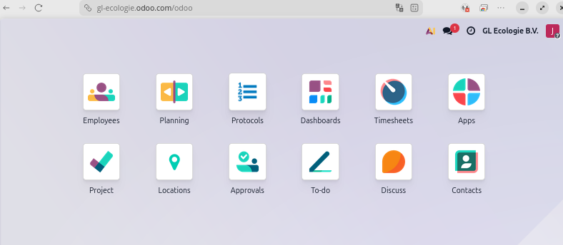
</p>
<center><i> Home page for non administrator users </i></center>


### Language

The system supports limited automatic translation of the platform to multiple languages. Dutch and English are currently supported. 

If you would like the platform language changed, please contact your manager or platform administrator.
If you are a manager/administrator, you can chage the language for a specific user at:

*Settings* → *Users & Companies* → *Users* → (the desired user) → *Preferences* → *Language* 

### Mobile use

The system works on mobile browsers. For the best experience when checking your schedule or registering hours on the go, use the Planning app in list or calendar view. The availability calendar works best on a desktop.

In addition, Odoo has a mobile phone apps available for both [*Android*](https://play.google.com/store/apps/details?id=com.odoo.mobile) and [*iOS*](https://apps.apple.com/app/odoo/id1272543640)

---

## 3. For All Users

### 3.1 General features across apps

#### Menus
A menu bar is displayed at the top of each application page. Each menu option will either redirect to a page or will display a sub-menu list, which when clicked will redirect to its assigned page.
<br>
<p align="center">
  
</p>
<center><i> Menu bar for the Planning app (as a non admin user) </i></center>
<br>

#### Views
The platform offers multiple types of ways to visualize information at a given page, called views. The most common views are ***Form***, ***List***, ***Gantt***, ***Pivot*** and ***Calendar***. Which views are available at a given time depend on the specific page. Furthermore, different views will offer different features/operations.

You can pick which view you want by clicking on the respective icon displayed at the top-right of the window:
<br>
<p align="center">
  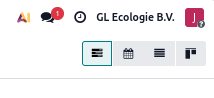
</p>
<center><i> View icon section of form. Click one will switch to that view. </i></center>
<br>

#### Saving changes on current entry/form
When adding or editing single entries -availability, shifts, tasks, etc.-, **changes are automatically saved if you leave that page**. In addition, ***Save*** and ***Discard*** small buttons will appear on the top left section, underneath the menu bar (often next to other Buttons.), a **cloud shaped button** for the former and an **x shaped button** for the latter.

<br>
<p align="center">
   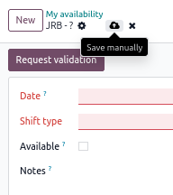
</p>
<center><i>Save and discard buttons for single entry</i></center>
<br>

#### Searching, filtering and grouping entries
Many views (List, Gantt, Calendar...) display a search bar at the top center of the page. This bar allows to search for entries (records), filter and/or group them following specific criteria. For instance, it's possible to show only the availability entries for a specific resource, or to group shifts by a project and task. These are just two examples of what is possible.

<br>
<p align="center">
   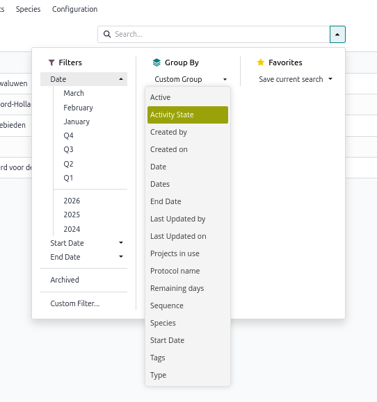
</p>
<center><i>Search, filter and/or group entries</i></center>
<br>

<br>
<p align="center">
   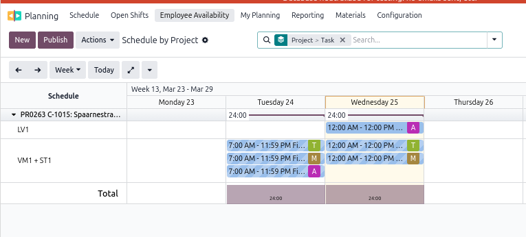
</p>
<center><i>Example: Planning schedule grouped by project and task</i></center>
<br>

#### Action buttons
Besides the intuitive buttons visible throughout the platform, there are a *category* of buttons, the so called ***Actions buttons*** which are either easy to miss, or only become visible under certain circumstances: for instance when a record is selected ***List*** **view**. You can identify them by their icon (a toothed wheel or gearwheel), sometimes accompanied by the word ***Actions***.

These buttons offer different functionalities, like exporting/importing records, deleting selected records, etc. 


<br>
<p align="center">
   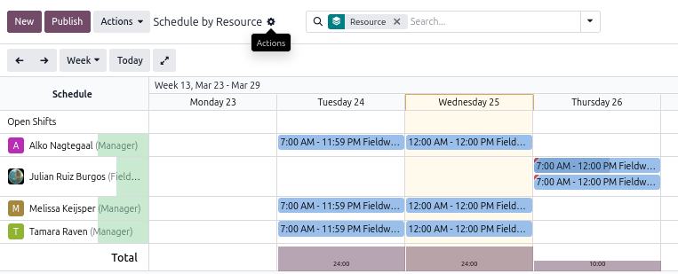
</p>
<center><i>Actions button, icon only. Often shows importing/exporting options.</i></center>
<br>

<br>
<p align="center">
   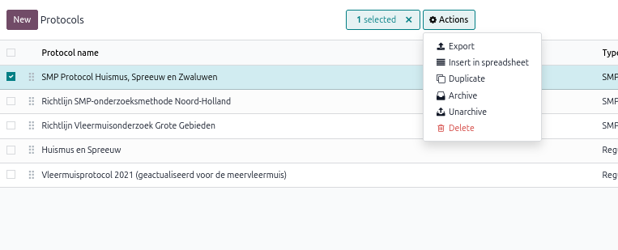
</p>
<center><i>Actions button, icon and label, with multiple options</i></center>
<br>

### 3.2 Your Employee Profile

Your employee profile stores your personal preferences that the planning system uses when assigning shifts. This profile can only be edited by managers or system administrators. If you want to have your employee profile updated (for instance if your maximum number of shifts per week changed, or you got access to a vehicle) please notify your manager or system administrator and they will update your profile.

**To find your profile:** *Employees* → (your name).

The following information is available:

| Tab | Information |
|-------|---------------|
| **All** | Employee name, email address, contact phone numbers |
|**Work** tab | Department job title, manager, office location, work location, planning constraints -maximum shifts per week, allowed shift types, weekend availability and willingness to combine evening and morning shifts.)|
| **Resume** | Work experience, skills & certifications |
|**Certifications** | Employee certifications |

Non manager/administrator employees can only see their own profile.

---

### 3.3 Filling In Your Availability

Before a manager can assign you to a shift, you must declare your availability and have it **validated**. This is the most important step in the planning workflow.

#### How availability works

The system operates in **strict mode**: if there is no validated availability entry for a given date and shift type, you are treated as unavailable — even if you are free that day. You must proactively declare availability for every date and shift type you are willing to work.

#### Step-by-step

1. Go to **Planning → Employee Availability → My Availability**
2. Two views are available: Calendar (default) or List:
   - **Calendar** view:
      1. Select on **one or multiple days** (control + click to select multiple non-consecutive days, shift + click to select all days in a specific range or simply click and drag across calendar days)
      2. Click on the ***Add*** button that will appear on top of the Calendar, **next to the *N selected*** **information box.**
      3. Fill in:
         - **Shift type**: the type of shift you are/are not available for (morning, evening, etc.)
         - **Available**: check this box if you *are* available; leave unchecked if you want to declare that you are *not* available for that day/shift
      4. Press ***Add***
   - **List** view:
      1. Press the ***New*** button at the top left of the screen.
      2. Fill in:
         - **Date**: the date you want to specify availability for.
         - **Shift type**: the type of shift you are/are not available for (morning, evening, etc.)
         - **Available**: check this box if you ***are*** available; leave unchecked if you want to declare that you are ***not*** available for that day/shift
         - **Notes**: Any extra information the manager should know.
      3. Press on the cloud shaped save button to save, or the cross button to discard.

<br>
<p align="center">
   
</p>
<center><i>New employee availability entry in list mode - Save button</i></center>
<br>

> **New availability entries are automatically sent for validation**.

> You need **one entry per date per shift type**. If you are available for both a morning and an evening on the same day, create two separate entries.

#### What happens next?

After you save, the entry status changes to **Validation Requested** and your manager receives a to-do notification. Once the manager validates it, you will receive a confirmation notification and the entry will turn solid green (confirmed available) in your calendar or solid red (confirmed not available).
Alternatively, the manager might decide to deny the validation request. In this case your entry/ies will be sent back to ***Draft*** state. You can then adjust them and send them again for validation.

#### Viewing your availability calendar

The calendar view shows all your entries colour-coded by status:

| Colour | Meaning |
|--------|---------|
| Grey stripes | Draft — not yet submitted |
| Green stripes | Submitted, waiting for validation |
| Red stripes | Submitted unavailable, waiting for validation |
| Solid green | Validated — available |
| Solid red | Validated — not available |

> **If your availability changes** after it has been validated, edit the entry (change the date, shift type, or available flag). It will automatically reset to *Validation Requested* and your manager will be notified again.

Clicking on an entry will display a popup form with the details of that entry. You can also edit the entry by click the ***Edit*** button at its foot.

#### Editing your availability

Availability can be edited one **single entry at a time by clicking on a specific entry** or by selecting **multiple entries at a time** (batch editing), the two options availble in both list an calendar view).

The steps to batch editing are as follow, depending on the view:
   - **Calendar** view:
      1. Select on **one or multiple days** which contain existing entries (same procedure as for creating)
      2. Click on the ***Edit*** button that will appear on top of the Calendar, **next to the *N selected*** **information box.** 
      3. Select which field you would like to edit:
         - **Update Shift type**: If checked, it will display the ***Shift type*** field so you can edit it.
         - **Update availability**: If checked, it will display the ***Available*** field so you can edit it.
      4. Press ***Apply*** or ***Discard*** to accept or discard the changes.
   - **List** view:
      1. Select the entries you want to edit.
      2. An ***Actions*** button will appear on top of the Calendar, **next to the *N selected*** **information box.**. Press on ***Actions*** → ***Batch edit availability***
      3. Select which field you would like to edit:
         - **Update Shift type**: If checked, it will display the ***Shift type*** field so you can edit it.
         - **Update availability**: If checked, it will display the ***Available*** field so you can edit it.
      4. Press ***Apply*** or ***Discard*** to accept or discard the changes.

<br>

> **Edited availability entries are automatically sent for validation**.

---

### 3.4 Viewing Your Schedule and Open Shifts

Go to **Planning → My Planning** to see all shifts you are assigned to, and any open shifts available (shifts that have been created and published by a manager but do not yet have an assigned resource).
The default view is a ***Gantt***, displayed **weekly**. If you want to see a different time split you can change that by either selecting a different time window (monthly, quarterly, yearly...) on the top left. Alternatively you can select a different view, like **Calendar** (that defaults to monthly).

Clicking on a specific shift will allow you to view that shift information (by clicking on the ***View*** button).

<br>
<p align="center">
   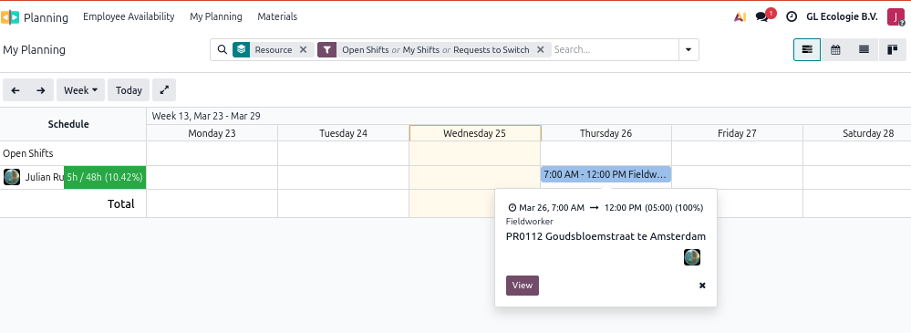
</p>
<center><i>My weekly schedule as shown by the Gantt view. Clicking on a specific shift shows a short description popup.</i></center>
<br>

Each shift form shows the following information:
| Field | Description | Sample values|
|---|---|---|
|***Resource*** | Who is assigned to this shift. Empty in the case of Open shifts. | *Joost van NotMyTrueName*, *John Doe* |
|***Role*** | What role this shift is for. | *Fieldworker*, *Project leader* |
|***Project*** | What project -if any- this shift is associated with. | *Top Secret project 001: Invade Greenland* |
|***Task*** | What task of the specified project -if any- this shift is associated with | *Task 01: Negotiate assistance with Donald T.* |
|***Shift type***| Shift type associated to this shift | *Hangover morning (16:00-18:00)*, *Borrel evening (16:00-18:00)*|
|***Date***| Date and time of this shift | *Mar 26, 16:00 → Mar 26m 18:00*|
|***Allocated time*** | Length of the shift in *hours:minutes* | 02:00 |
|***Counts for max shift per week?***| Whether this shift should take into account employee's maximum  shift per week constraint | *Yes*, *No* |
|***Required Materials***| Which material types are needed for this shift? | *Batlogger*, *Camera Trap*, *USS Gerald R. Ford* |
|***Reminder***| Optional preparation note.  When not empty it will trigger an e-mail reminder 24h before the shift's date. | *Remember to pick up the car keys from the oval office*|

>You will also receive an **email notification** when your schedule is published or updated, and an automated **reminder email** 24 hours before each shift that has a preparation note.

<br>
<p align="center">
   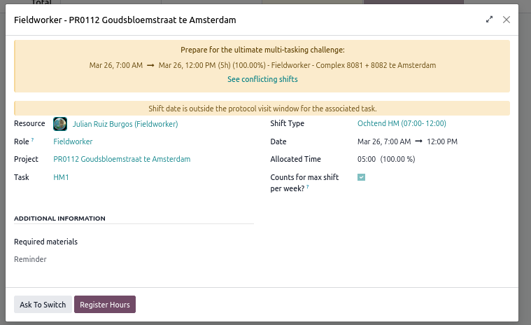
</p>
<center><i>Assigned shift with conflict. ***Ask to switch*** button available.</i></center>
<br>

> You cannot self-unassign from a shift. If you are not available for a shift that has been assigned to you, open the affected shift and press the ***Ask to switch***  button and notify your manager.


### 3.5 Requesting an Open Shift

You can request being assigned to an open shift. **A manager will then either approve or reject that request.**

1. Go to **Planning → My Planning** (or the main Planning view)
2. Open shifts are shown without a name in the resource column
3. Click the shift to open it
4. Click **Request shift** — this sends a notification to your manager
5. Your manager will review the request and either assign you or choose a different person

<br>
<p align="center">
   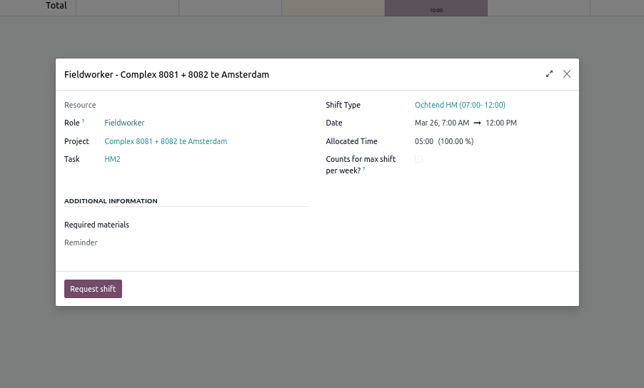
</p>
<center><i>Requesting an open shift</i></center>
<br>

> You **cannot self-assign** to a shift. The *Request shift* button notifies your manager, who makes the final assignment.

### 3.6 Registering Hours
The ***Timesheets*** app of the platform allows you to register your worked hours.

The easiest way to do so, however, is via the planning app:

1. Go to **Planning → My Planning** and open the shift you want to register hours for.
2. Press the **Register hours** button. This will create a new timsheet entry and open it for you.

   <br>
   <p align="center">
      
   </p>
   <center><i>Assigned shift. ***Register hours*** button available.</i></center>
   <br>
3. As you will see, the entry has already been pre-filled. **You don't need to change anything here** unless something changed from the initial planning (for instance if the shift took longer or shorter than initially defined). If you want, however, **you can add a description or comment** using the unnamed field immediately below ***Shift***, which by default is just populated with ***"/"*** character. 

   <br>
   <p align="center">
      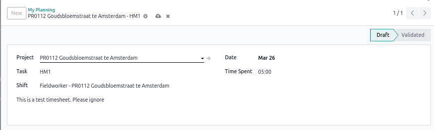
   </p>
   <center><i>Timesheet entry with example description field</i></center>
   <br>

   > **Caution!!**
   >
   >Every time the **Register hours** button is pressed, the allocated hours will be registered. This is by design.

<br>

Alternatively, you can register your hours directly from the ***Timesheet*** app:
1. From the home menu, open the ***Timesheets*** app. This will immediately open your time sheets ***Grid*** view.
2. The grid view might already **show some of your shifts, even if you have not registered hours yet**. **This is normal**. The advantage of this view is that it shows you a whole day/week/month, so you could easily register hours for shifts that span multiple days. 

   > **Caution!!**
   >
   > **Any changes made in this view are are automatically saved**.

3. **Alternatively**, you can go to the **list view, and press ***New***** on the top left. This will immediately create a new entry (row) and ask you to **manually fill in the different fields**. Once you've filled the entry, press the ***Save*** button on the top left.

   > **Caution!!**
   >
   > **You are responsible for correctly filling the different fields. Make sure the project and tasks selected match the selected shift**.

#### What if you made a mistake?
If you realise that you've made a mistake when registering hours for a shift, you can look for the relevant entry(ies) in the ***List view*** and update or delete it/them. 
   > **Caution!!**
   >
   > **Validated entries cannot be edited or deleted**.

### 3.7 Viewing Your Timesheets
If you want to view your timesheets (to check whether they have already been validated or not, for instance), you just need to **open the Timesheets app in ***List*** or ***Calendar*** view**. You can also open a specific entry to see its state on the top right corner of the form.

<br>
   <p align="center">
      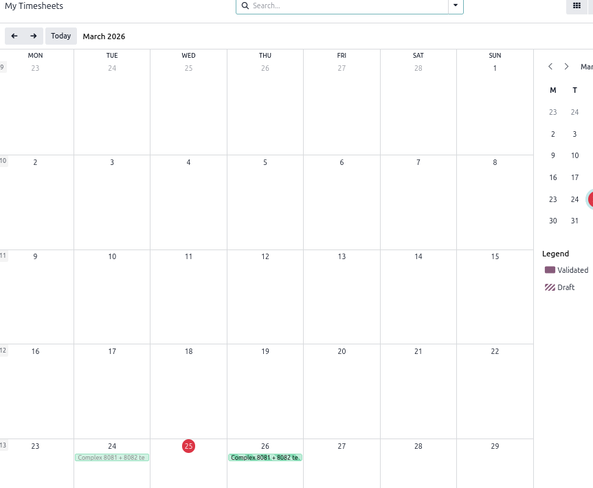
   </p>
   <center><i>My timesheets calendar view. Draft (not yet validated) entries have stripes while validated ones show solid coloring</i></center>
<br>
<br>
<br>
   <p align="center">
      
   </p>
   <center><i>Timesheet entry. Notice validation state on the top right corner (Draft)</i></center>
<br>

---

## 4. For Managers & Project Leaders

### 4.1 Managing Employees

#### 4.1.1 Adding and editing employees

> *[TODO: Tamara — you are already familiar with this area. Add any notes specific to your GL-Ecologie process, e.g. how new employees are onboarded, naming conventions, etc.]*

Key points:
- Create a new employee via **Employees → New**
- Always fill in the **Planning** tab: shift type preferences, max shifts per week, weekend availability, and evening/morning combination preference — these directly affect which shifts the employee can be assigned to
- Link the employee to a user account (Work Information tab → Related User) so they can log in and manage their own availability
- Assign one or more **planning roles** (e.g. Field Worker, Project Leader) — the employee will only appear as a candidate for shifts that require one of their assigned roles


| Field | What it means |
|-------|---------------|
| **Max shifts per week** | The maximum number of shifts you want to work in a single week. The system will not assign you beyond this number. Set to 0 if there is no limit. |
| **Available to work weekends** | If unchecked, you will not be offered or assigned to Saturday/Sunday shifts, Friday evening shifts, or Monday morning shifts. |
| **Combine evening and morning shift** | If unchecked, the system will not assign you to a morning shift the day after an evening shift (and vice versa). |
| **Shift type preferences** | The types of shifts (morning, evening, etc.) you are willing to work. You will only appear as a candidate for shift types listed here. |
| **Vehicle** | Whether you have a vehicle available. |
| **Language** | Your working language (Dutch / other). |

> **Important:** changes to these fields take effect immediately for future shift assignments. They do not affect shifts you are already assigned to.

---

### 4.2 Locations & Meeting Points

> *[TODO: Tamara — brief description of how you use locations and meeting points in your workflow.]*

---

### 4.3 Protocols

> *[TODO: Tamara — you are already managing protocols. Add a brief description of what a protocol is in GL-Ecologie's context, the key fields, and how protocols connect to projects.]*

---

### 4.4 Projects & Sub-projects

> *[TODO: Tamara — brief walkthrough of creating a project, required fields, and how sub-projects are structured.]*

Key system behaviours to note:
- Each project can have one or more **tasks**. Shifts can be linked to a specific task on a project.
- The **Assigned shifts** tab on a task shows all shifts linked to that task — useful for tracking how many shifts have been planned for a given monitoring visit.
- A task displays a warning banner when the number of assigned people falls below the required number set in the *People needed* field.
- The **Create Shifts** button on a task form opens the multi-resource wizard pre-filled with that task's project and task (see §4.7).
- Once at least one shift exists for the task, an **Edit Shifts** button appears showing the shift count. Clicking it opens the bulk-edit wizard pre-loaded with all shifts for that task.

---

### 4.5 Shift Types & Roles

Shift types and roles are configured under **Planning → Configuration**.

**Shift types** (e.g. Morning, Evening, Night) define the time-of-day category of a shift. They are used in:
- Employee preference matching (employees declare which types they want to work)
- Evening/morning conflict detection (an employee who does not want to combine shifts cannot be assigned to a morning shift the day after an evening shift)
- Availability entries (employees declare availability per date *and* per shift type)

> **Important naming rule:** for evening/morning conflict detection to work, the shift type name must end in *"vening"* (e.g. "Evening") or *"orning"* (e.g. "Morning"). Do not rename shift types unless you are certain this rule is still satisfied.

**Roles** (e.g. Field Worker, Project Leader) define the function performed on a shift. An employee must have the required role assigned on their profile to appear as a candidate for a shift with that role.

---

### 4.6 Creating & Publishing Shifts

#### Creating a shift

1. Go to **Planning** and click **New**, or click directly on a time slot in the Gantt view
2. Fill in the required fields:

| Field | Notes |
|-------|-------|
| **Resource** | The employee to assign. Leave empty to create an open shift. The dropdown only shows eligible candidates (see §4.7). |
| **Role** | The function required for this shift |
| **Shift type** | Morning, Evening, etc. Must match the employee's preferences |
| **Project** | The project this shift belongs to |
| **Task** | The specific task within the project (optional but recommended) |
| **Date / Time** | Start and end datetime |
| **Allocated hours** | Auto-calculated from start/end; can be adjusted |
| **Counts for max shift per week** | Uncheck to exclude this shift from the weekly cap (e.g. for training shifts or special arrangements) |
| **Materials needed** | Any equipment required for this shift |
| **Reminder** | A preparation note sent automatically to the assigned employee 24 hours before the shift (e.g. "Pick up keys from the office before departure") |

#### Protocol visit window warning

If the shift is linked to a task that has a protocol visit, and the shift date falls **outside** the defined monitoring window for that visit, an amber warning bar appears at the top of the shift form:

> *"Shift date is outside the protocol visit window for the associated task."*

This is informational only — the shift can still be saved. Use it as a prompt to double-check the date.

#### Related visit minimum gap warning

Some protocol visits require a minimum number of days to have passed since a related (previous) visit. For example, HM2 may require at least 10 days after the most recent HM1 shift in the same project.

If this condition is not met, an amber warning bar appears with a specific message, for example:

> *"This shift is only 3 day(s) after the most recent HM1 shift. The required minimum gap is 10 day(s)."*

Like the window warning, this is informational only — the shift can still be saved. The same warning also appears in the **Create Multi-Resource Shifts** wizard when a date and task are selected.

The minimum gap and related visit are configured on the protocol visit record itself (by your system administrator).

#### Publishing a shift

A shift starts in **Draft** status. In this state it is not visible to field workers.

To make a shift visible and notify employees:
- Click **Publish & Send** — publishes the shift and sends an email notification to the assigned employee
- Or click **Send** on an already-published shift to re-send the notification

> Publish shifts only once the assignment is confirmed. Employees receive an email each time you send.

#### Recurring shifts

To create a repeating shift, enable the **Repeat** toggle on the shift form and configure the interval and end condition. All occurrences are created at once and can be edited individually or as a group.

---

### 4.7 Creating Multiple Shifts at Once

When a project requires several people to be scheduled for the same shift (same date, time, role, and project), use the **Create Multi-Resource Shifts** wizard instead of creating shifts one by one.

#### Opening the wizard

There are three ways to open it:

| From | How |
|------|-----|
| **Planning menu** | Planning → Schedule → *Create Multi-Resource Shifts* |
| **Task form** | Open a task → click the **Create Shifts** button in the top-right button area |
| **Shift list view** | Select one or more shifts → click **Edit Selected Shifts** (opens in edit mode) |

#### Create mode — filling in shift details

The wizard has two columns: **Shift Details** on the left and **Assign Resources** on the right.

Fill in the Shift Details first:

| Field | Notes |
|-------|-------|
| **Role** | Required — filters which employees appear as candidates |
| **Shift Template** | Optional — pre-fills date/time from a saved template |
| **Shift Type** | Required — must match employee preferences |
| **Date** | Start and end date/time for the shift |
| **Project / Task** | The project and task this shift belongs to |
| **Counts for max shift per week** | Uncheck for shifts that should not count against the weekly cap |
| **Required materials** | Equipment types needed |
| **Reminder** | Preparation note sent to each assigned employee 24h before the shift |

> Once Role, Shift Type, and Date are filled in, the Assign Resources column automatically shows all eligible employees as selectable tags.

#### Selecting resources

Click the name of each employee you want to assign. Selected names are highlighted in purple. You can select as many as needed — one shift will be created per selected employee.

> Only employees who pass **all** eligibility checks are shown: role match, shift type preference, validated availability, weekly cap, evening/morning conflict, and weekend availability. If someone you expect is missing, check their availability entries for that date.

#### Protocol visit window warning

If the selected date falls outside the protocol visit window for the linked task, an amber warning banner appears above the form. The shift can still be created — the warning is informational only.

#### After clicking Create Shifts

One shift is created per selected employee. If any employee fails a constraint at save time (which can happen in edge cases), a summary banner lists who was created and who was skipped, with the reason.

---

#### Edit mode — bulk-editing existing shifts

To update several shifts at once:

1. Go to **Planning → Schedule** in list view
2. Select the shifts you want to edit (tick the checkboxes)
3. Click **Edit Selected Shifts** in the action bar
4. The wizard shows the selected shifts as tags at the top
5. Tick the checkbox next to each field you want to update, then fill in the new value
6. Click **Apply Changes** — only ticked fields are written

> If you want to update the Task but not the Project, tick only *Update task*. The project on existing shifts is left unchanged.

---

### 4.8 Assigning People to Shifts

#### How the candidate list is filtered

The **Resource** dropdown on a shift does not show all employees — it shows only those who are eligible for that specific shift at that specific time. An employee must satisfy **all** of the following:

1. **Role match** — has the shift's required role in their profile
2. **Shift type preference** — has opted into this shift type
3. **Validated availability** — has a validated availability entry for this date and shift type
4. **Weekly shift cap** — would not exceed their maximum shifts for that week (if the shift counts toward the cap)
5. **No evening/morning conflict** — would not be assigned to a morning shift the day after an evening shift (or vice versa), if they have opted out of combining these
6. **Weekend availability** — works weekends (or the shift is not a weekend/Friday evening/Monday morning shift)

If the dropdown shows no candidates, it usually means one or more employees have not yet had their availability validated for that date and shift type. Check **Planning → Employee Availability** and validate pending entries first.

> The system also enforces these rules when you save — if an ineligible employee is somehow selected, saving will show a clear error message explaining which rule was violated.

#### Assigning a person

1. Open the shift
2. Select the employee from the **Resource** dropdown
3. Click **Publish & Send** to notify them

#### Handling shift requests

When an employee requests an open shift (see §3.3), you will receive a notification in your Inbox. Review the request, open the shift, assign the employee, and publish.

---

### 4.9 Registering & Validating Worked Hours

#### Register Hours button

Once a shift is published and has an assigned employee, a **Register Hours** button appears in the shift header (visible to the assigned employee and to planning managers).

Clicking it creates a pre-filled timesheet entry with:
- The shift date
- The allocated hours
- The linked project and task

The timesheet opens immediately for review. Adjust the hours if the employee worked more or less than planned, then save.

> The Register Hours button is only visible **after the shift is published** and **only to the assigned employee or a planning manager**. Other managers cannot register hours on behalf of someone else's shift.

#### Validating timesheets

> *[TODO: Tamara — describe your validation/approval flow for timesheets if you have one configured.]*

---

## 5. Inventory & Tools

The inventory module is accessible via **Planning → Materials**.

### Structure

Materials are organised in three levels:

```
Category  (e.g. Acoustic equipment)
  └─ Material type  (e.g. Bat detector SM4)
       └─ Material unit  (individual physical item, e.g. SM4 #003)
```

Each **material unit** has:
- A **status** (e.g. In service, Out for repair, Lost)
- A serial number (optional)
- A rental flag (if the item is rented rather than owned)

### Linking materials to a shift

On a shift form, use the **Materials needed** field to attach one or more material *types* to the shift. This records which types of equipment are required — it does not automatically reserve individual units or deduct stock.

> Stock quantities (`booked_quantity`, `needed_stock`) are manually maintained. There is no automatic deduction when a shift is created.

### Checking what is assigned

Open any material type to see the list of individual units and their current statuses. Use the list view under **Planning → Materials → Material Types** to get an overview of available vs. booked quantities across all types.

---

## 6. Reporting & Exports

### 6.1 Planning Analysis

**Planning → Reporting → Planning Analysis**

Useful measures and groupings:

| What you want to know | Measure | Group by |
|-----------------------|---------|----------|
| Total planned hours per project | Allocated Time | Project |
| Hours per employee per month | Allocated Time | Resource, Start date (month) |
| Shifts per employee per week | Count | Resource, Start date (week) |
| Actual vs. planned hours | Effective Time vs. Allocated Time | Project or Resource |
| Planning progress (%) | Progress | Project |

Export to Excel using the **⬇ Download** button (list view) or via **Action → Export**.

### 6.2 Availability Export

**Planning → Employee Availability → (list view) → Action → Export**

Useful for reviewing who declared availability for a given period before creating shifts.

### 6.3 PDF Reports

> *[TODO: add if/when implemented.]*

---

## 7. Notifications & Approvals

### Notifications you will receive

| Event | Who receives it | How |
|-------|----------------|-----|
| Shift published / sent | Assigned employee | Email |
| Shift reminder | Assigned employee | Email, 24h before shift (only if a *Reminder* note is set on the shift) |
| Availability validated | Employee whose entry was validated | Inbox notification + live toast |
| Availability reset to draft | Employee | Inbox notification + live toast |
| Shift request submitted | Planning managers | To-do activity |
| Availability submitted for validation | Planning managers | To-do activity |

### Pending approvals

Planning managers can see pending availability validations as **to-do activities** in their Activity view or in the Inbox. Each activity groups all pending entries from one employee and shows the date range covered.

To validate: open the activity, review the availability entries, and click **Validate**.

---

## Appendix

### Glossary

| Term | Meaning |
|------|---------|
| **Shift** | A single work assignment: one employee, one date, one role, one project |
| **Open shift** | A shift without an assigned employee — available for employees to request |
| **Shift type** | The time-of-day category of a shift (Morning, Evening, etc.) |
| **Role** | The function performed on a shift (Field Worker, Project Leader, etc.) |
| **Availability entry** | A declaration by an employee that they are (or are not) available on a specific date for a specific shift type |
| **Validated availability** | An availability entry confirmed by a manager — required before an employee can be assigned |
| **Protocol** | *[TODO: Tamara — add GL-Ecologie definition]* |
| **Protocol visit** | *[TODO: Tamara — add GL-Ecologie definition]* |

### Contact for support

For technical issues with the system, contact:
**Julian Ruiz Burgos** — Ruiz Burgos Ecology and Software
`[TODO: add contact email/phone]`
