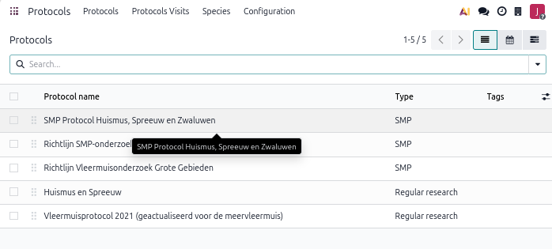
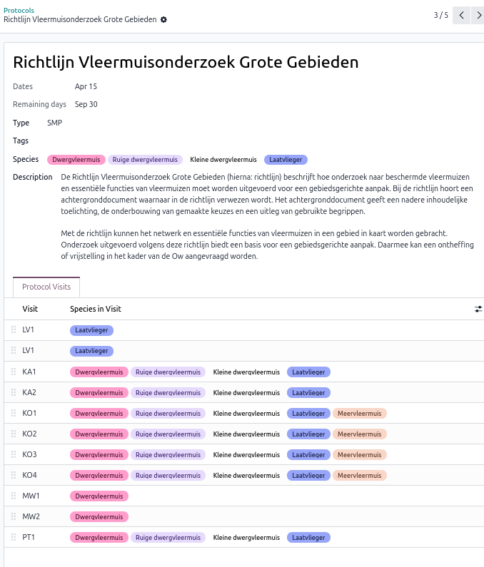
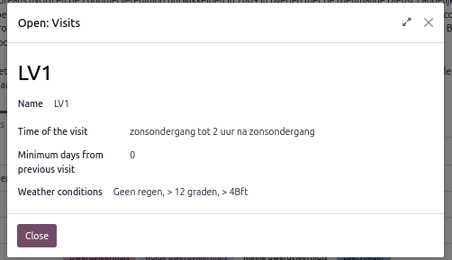
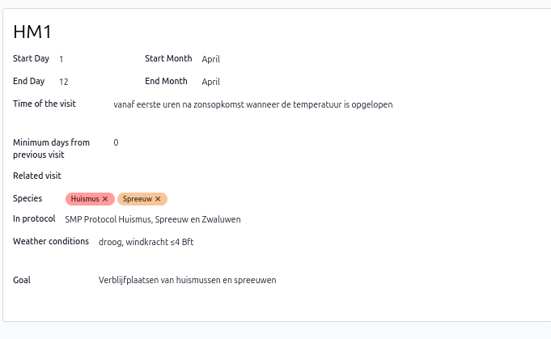
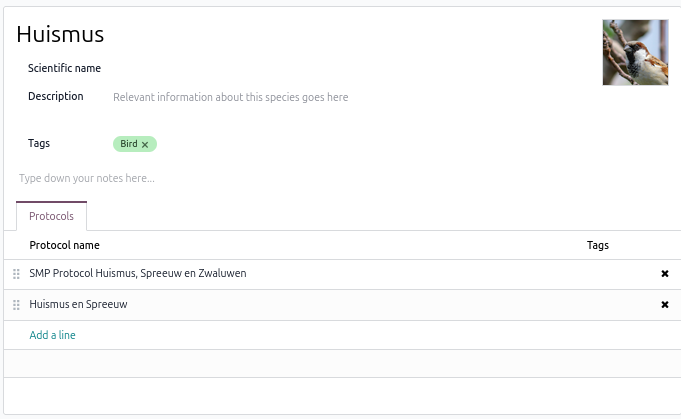
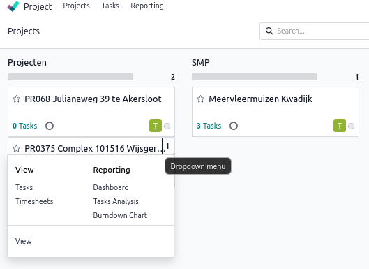
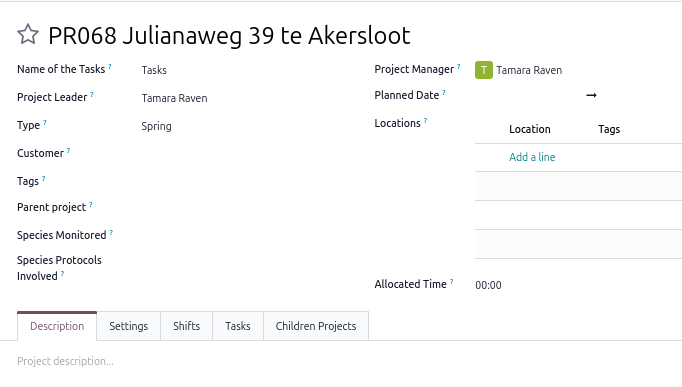
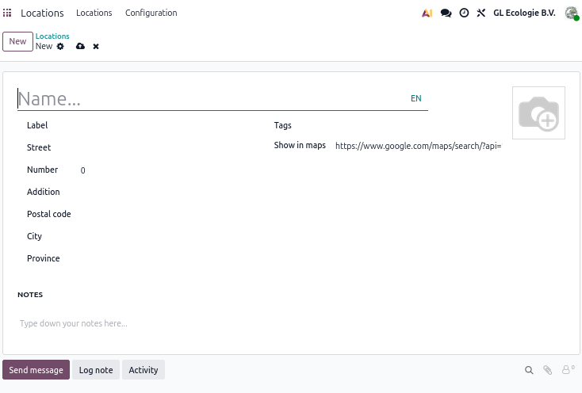
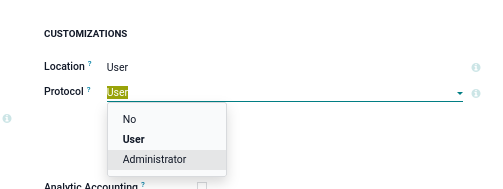

# GL-Ecologie — Odoo Planning System: User Guide

**Version:** 1.3
**Last updated:** 2026-03-26
**Prepared by:** Ruiz Burgos Ecology and Software

---

## Table of Contents

1. [Introduction](#introduction)
2. [Getting Started](#getting-started)
3. [For All Users](#for-all-users)
   - 3.1 [General features across apps](#general-features-across-apps)
   - 3.2 [Your Employee Profile](#your-employee-profile)
   - 3.3 [Filling In Your Availability](#filling-in-your-availability)
   - 3.4 [Viewing Your Schedule and Open Shifts](#viewing-your-schedule-and-open-shifts)
   - 3.5 [Requesting an Open Shift](#requesting-an-open-shift)
   - 3.6 [Registering Hours](#registering-hours)
   - 3.7 [Viewing Your Timesheets](#viewing-your-timesheets)
   - 3.8 [Viewing Locations](#viewing-locations)
   - 3.9 [Viewing Protocols, Protocol Visits and Species](#viewing-protocols-protocol-visits-and-species)
   - 3.10 [Viewing Projects and Tasks](#viewing-project-and-tasks)
4. [For Managers & Project Leaders](#4-for-managers--project-leaders)
   - 4.1 [Managing Employees](#41-managing-employees)
     - 4.1.1 [Adding and editing employees](#411-adding-and-editing-employees)
     - 4.1.2 [Deleting employees](#412-deleting-employees)
   - 4.2 [Locations & Meeting Points](#42-locations--meeting-points)
   - 4.3 [Protocols](#43-protocols)
     - 4.3.1 [Creating and deleting protocols](#431-creating-and-deleting-protocols)
     - 4.3.2 [Protocol visits](#432-protocol-visits)
   - 4.4 [Projects & Tasks](#44-projects--tasks)
     - 4.4.1 [Customizations](#441-customizations)
     - 4.4.2 [Projects](#442-projects)
       - 4.4.2.1 [Add and delete projects](#4421-add-and-delete-projects)
       - 4.4.2.2 [Creating a project template](#4422-creating-a-project-template)
       - 4.4.2.3 [Creating subprojects](#4423-creating-subprojects)
     - 4.4.3 [Tasks](#443-tasks)
       - 4.4.3.1 [Assigning shifts to a task](#4431-assigning-shifts-to-a-task)
   - 4.5 [Planning](#45-planning)
     - 4.5.1 [Shift Types & Roles](#451-shift-types-and-shift-roles)
       - 4.5.1.1 [Shift types](#4511-shift-types)
       - 4.5.1.2 [Shift roles](#4512-shift-roles)
     - 4.5.2 [Creating & Publishing Shifts](#452-creating--publishing-shifts)
       - 4.5.2.1 [Creating a shift](#4521-creating-a-shift)
       - 4.5.2.2 [Publishing a shift](#4522-publishing-a-shift)
     - 4.5.3 [Creating Multiple Shifts at Once](#453-creating-multiple-shifts-at-once)
       - 4.5.3.1 [Opening the wizard](#4531-opening-the-wizard)
       - 4.5.3.2 [Create mode — filling in shift details](#4532-create-mode--filling-in-shift-details)
       - 4.5.3.3 [Edit mode — bulk-editing existing shifts](#4533-edit-mode--bulk-editing-existing-shifts)
     - 4.5.4 [Assigning People to Shifts](#454-assigning-people-to-shifts)
       - 4.5.4.1 [How the candidate list is filtered](#4541-how-the-candidate-list-is-filtered)
   - 4.6 [Validations](#46-validations)
     - 4.6.1 [Employee Availability](#461-employee-availability)
     - 4.6.2 [Shift Requests](#462-shift-requests)
     - 4.6.3 [Timesheets](#463-timesheets)
   - 4.7 [Inventory & Materials](#47-inventory--materials)
5. [Notifications & Approvals](#notifications-approvals)

---

## 1. Introduction

This guide covers the day-to-day use of the GL-Ecologie planning system implemented using the Odoo platform. It is intended for **managers and project leaders**, and covers both the general features available to all users (§2–§3) and the manager-specific features (§4 onwards).

If you are new to the system, start with §2 (Getting Started) and then proceed to §4 for manager-specific workflows.

---

## 2. Getting Started

### 2.1 Accessing the system

The system is available at: [**https://gl-ecologie.odoo.com/odoo**](https://gl-ecologie.odoo.com/odoo)

Log in with the email address and password defined when your account was created (either provided by your manager or specified by you). If you have forgotten your password, click *Reset password* on the login page and follow the instructions sent to your email.

### 2.2 Navigating the main menu

After logging in you will see the main application menu at the top of the screen. The apps you will use most often are:

| App | Used for |
|-----|----------|
| **Employees** | Your employee profile |
| **Planning** | Shifts, availability, your schedule |
| **Project** | Projects, tasks |
| **Protocols** | Protocols, protocol visits and species|
| **Timesheets** | Timesheets tracking |
| **Approvals** | Approval requests status, validation and tracking |

Administrators also have access to the **Settings** app, where system configuration is handled.

<p align="center">
  
</p>
<center><i> Home page for non administrator users </i></center>


### 2.3 Language

The system supports limited automatic translation of the platform to multiple languages. Dutch and English are currently supported. 

If you would like the platform language changed, please contact your manager or platform administrator.
If you are a manager/administrator, you can chage the language for a specific user at:

*Settings* → *Users & Companies* → *Users* → (the desired user) → *Preferences* → *Language* 

### 2.4 Mobile use

The system works on mobile browsers. For the best experience when checking your schedule or registering hours on the go, use the Planning app in list or calendar view. The availability calendar works best on a desktop.

In addition, Odoo has a mobile phone apps available for both [*Android*](https://play.google.com/store/apps/details?id=com.odoo.mobile) and [*iOS*](https://apps.apple.com/app/odoo/id1272543640)

---

## 3. For All Users

### 3.1 General features across apps

#### Menus
A menu bar is displayed at the top of each application page. Each menu option will either redirect to a page or will display a sub-menu list, which when clicked will redirect to its assigned page.
<br>
<p align="center">
  
</p>
<center><i> Menu bar for the Planning app (as a non admin user) </i></center>
<br>

#### Views
The platform offers multiple types of ways to visualize information at a given page, called views. The most common views are ***Form***, ***List***, ***Gantt***, ***Pivot*** and ***Calendar***. Which views are available at a given time depend on the specific page. Furthermore, different views will offer different features/operations.

You can pick which view you want by clicking on the respective icon displayed at the top-right of the window:
<br>
<p align="center">
  
</p>
<center><i> View icon section of form. Click one will switch to that view. </i></center>
<br>

#### Saving changes on current entry/form
When adding or editing single entries -availability, shifts, tasks, etc.-, **changes are automatically saved if you leave that page**. In addition, ***Save*** and ***Discard*** small buttons will appear on the top left section, underneath the menu bar (often next to other Buttons.), a **cloud shaped button** for the former and an **x shaped button** for the latter.

<br>
<p align="center">
   
</p>
<center><i>Save and discard buttons for single entry</i></center>
<br>

#### Searching, filtering and grouping entries
Many views (List, Gantt, Calendar...) display a search bar at the top center of the page. This bar allows to search for entries (records), filter and/or group them following specific criteria. For instance, it's possible to show only the availability entries for a specific resource, or to group shifts by a project and task. These are just two examples of what is possible.

<br>
<p align="center">
   
</p>
<center><i>Search, filter and/or group entries</i></center>
<br>

<br>
<p align="center">
   
</p>
<center><i>Example: Planning schedule grouped by project and task</i></center>
<br>

#### Action buttons
Besides the intuitive buttons visible throughout the platform, there are a *category* of buttons, the so called ***Actions buttons*** which are either easy to miss, or only become visible under certain circumstances: for instance when a record is selected ***List*** **view**. You can identify them by their icon (a toothed wheel or gearwheel), sometimes accompanied by the word ***Actions***.

These buttons offer different functionalities, like exporting/importing records, deleting selected records, etc. 


<br>
<p align="center">
   
</p>
<center><i>Actions button, icon only. Often shows importing/exporting options.</i></center>
<br>

<br>
<p align="center">
   
</p>
<center><i>Actions button, icon and label, with multiple options</i></center>
<br>

### 3.2 Your Employee Profile

Your employee profile **stores your personal preferences** that the planning system uses when assigning shifts. **This profile can only be edited by managers or system administrators.** If you want to have your employee profile updated (for instance if your maximum number of shifts per week changed, or you got access to a vehicle) please notify your manager or system administrator and they will update your profile.

You can find your profile at ***Employees*** → (your name).

The following information is available:

| Tab | Information |
|-------|---------------|
| **All** | Employee name, email address, contact phone numbers |
|**Work** | Department job title, manager, office location, work location, planning constraints -maximum shifts per week, allowed shift types, weekend availability and willingness to combine evening and morning shifts.)|
| **Resume** | Work experience, skills & certifications |
|**Certifications** | Employee certifications |

<br>

> **Important!**
>
> Non manager/administrator employees can only see their own profile.

---

<div style="page-break-before: always;"></div>

### 3.3 Filling In Your Availability

Before a manager can assign you to a shift, you must declare your availability and have it **validated**. This is the most important step in the planning workflow.

#### How availability works

The system operates in **strict mode**: if there is no validated availability entry for a given date and shift type, you are treated as unavailable — even if you are free that day. You must proactively declare availability for every date and shift type you are willing to work.

#### Step-by-step

1. Go to **Planning → Employee Availability → My Availability**
2. Two views are available: Calendar (default) or List:
   - **Calendar** view:
      1. Select on **one or multiple days** (control + click to select multiple non-consecutive days, shift + click to select all days in a specific range or simply click and drag across calendar days)
      2. Click on the ***Add*** button that will appear on top of the Calendar, **next to the *N selected*** **information box.**
      3. Fill in:
         - **Shift type**: the type of shift you are/are not available for (morning, evening, etc.)
         - **Available**: check this box if you *are* available; leave unchecked if you want to declare that you are *not* available for that day/shift
      4. Press ***Add***
   - **List** view:
      1. Press the ***New*** button at the top left of the screen.
      2. Fill in:
         - **Date**: the date you want to specify availability for.
         - **Shift type**: the type of shift you are/are not available for (morning, evening, etc.)
         - **Available**: check this box if you ***are*** available; leave unchecked if you want to declare that you are ***not*** available for that day/shift
         - **Notes**: Any extra information the manager should know.
      3. Press on the cloud shaped save button to save, or the cross button to discard.

<br>
<p align="center">
   
</p>
<center><i>New employee availability entry in list mode - Save button</i></center>
<br>

> **New availability entries are automatically sent for validation**.

> You need **one entry per date per shift type**. If you are available for both a morning and an evening on the same day, create two separate entries.

#### What happens next?

After you save, the entry status changes to **Validation Requested** and your manager receives a to-do notification. Once the manager validates it, you will receive a confirmation notification and the entry will turn solid green (confirmed available) in your calendar or solid red (confirmed not available).
Alternatively, the manager might decide to deny the validation request. In this case your entry/ies will be sent back to ***Draft*** state. You can then adjust them and send them again for validation.

#### Viewing your availability calendar

The calendar view shows all your entries colour-coded by status:

| Colour | Meaning |
|--------|---------|
| **Grey stripes** | Draft — not yet submitted |
| **Green stripes** | Submitted, waiting for validation |
|**Red stripes**| Submitted unavailable, waiting for validation |
| **Solid green**| Validated — available |
| **Solid red** | Validated — not available |

> **If your availability changes** after it has been validated, edit the entry (change the date, shift type, or available flag). It will automatically reset to *Validation Requested* and your manager will be notified again.

Clicking on an entry will display a popup form with the details of that entry. You can also edit the entry by click the ***Edit*** button at its foot.

#### Editing your availability

Availability can be edited one **single entry at a time by clicking on a specific entry** or by selecting **multiple entries at a time** (batch editing), the two options availble in both list an calendar view).

The steps to batch editing are as follow, depending on the view:
   - **Calendar** view:
      1. Select on **one or multiple days** which contain existing entries (same procedure as for creating)
      2. Click on the ***Edit*** button that will appear on top of the Calendar, **next to the *N selected*** **information box.** 
      3. Select which field you would like to edit:
         - **Update Shift type**: If checked, it will display the ***Shift type*** field so you can edit it.
         - **Update availability**: If checked, it will display the ***Available*** field so you can edit it.
      4. Press ***Apply*** or ***Discard*** to accept or discard the changes.
   - **List** view:
      1. Select the entries you want to edit.
      2. An ***Actions*** button will appear on top of the Calendar, **next to the *N selected*** **information box.**. Press on ***Actions*** → ***Batch edit availability***
      3. Select which field you would like to edit:
         - **Update Shift type**: If checked, it will display the ***Shift type*** field so you can edit it.
         - **Update availability**: If checked, it will display the ***Available*** field so you can edit it.
      4. Press ***Apply*** or ***Discard*** to accept or discard the changes.

<br>

> **Edited availability entries are automatically sent for validation**.

---

<div style="page-break-before: always;"></div>

### 3.4 Viewing Your Schedule and Open Shifts

Go to **Planning → My Planning** to see all shifts you are assigned to, and any open shifts available (shifts that have been created and published by a manager but do not yet have an assigned resource).
The default view is a ***Gantt***, displayed **weekly**. If you want to see a different time split you can change that by either selecting a different time window (monthly, quarterly, yearly...) on the top left. Alternatively you can select a different view, like **Calendar** (that defaults to monthly).

Clicking on a specific shift will allow you to view that shift information (by clicking on the ***View*** button).

<br>
<p align="center">
   
</p>
<center><i>My weekly schedule as shown by the Gantt view. Clicking on a specific shift shows a short description popup.</i></center>
<br>

Each shift form shows the most relevant information you need for that shift:
| Field | Description | Sample values|
|---|---|---|
|***Resource*** | Who is assigned to this shift. Empty in the case of Open shifts. | *Joost van NotMyTrueName*, *John Doe* |
|***Role*** | What role this shift is for. | *Fieldworker*, *Project leader* |
|***Project*** | What project -if any- this shift is associated with. | *Top Secret project 001: Invade Greenland* |
|***Task*** | What task of the specified project -if any- this shift is associated with | *Task 01: Negotiate assistance with Donald T.* |
|***Shift type***| Shift type associated to this shift | *Hangover morning (16:00-18:00)*, *Borrel evening (16:00-18:00)*|
|***Date***| Date and time of this shift | *Mar 26, 16:00 → Mar 26m 18:00*|
|***Allocated time*** | Length of the shift in *hours:minutes* | 02:00 |
|***Counts for max shift per week?***| Whether this shift should take into account employee's maximum  shift per week constraint | *Yes*, *No* |
|***Required Materials***| Which material types are needed for this shift? | *Batlogger*, *Camera Trap*, *USS Gerald R. Ford* |
|***Reminder***| Optional preparation note.  When not empty it will trigger an e-mail reminder 24h before the shift's date. | *Remember to pick up the car keys from the oval office*|

<br>

>**Important!!**
>
>Some fields, like ***Role***, ***Project*** and ***Task***; will open a detailed form with the details about that specific field.
>
>For instance, if you are not sure where to go for your shift, **clicking on the project name will redirect you to the project details**, to see the location associated to this project. 
>
>(**See also section [Locations](#38-locations), to see how to get google map directions to a location.**)


<br>
<p align="center">
   
</p>
<center><i>Assigned shift with conflict. ***Ask to switch*** button available.</i></center>
<br>

>**Important!!**
>
> You cannot self-unassign from a shift. If you are not available for a shift that has been assigned to you, open the affected shift and press the ***Ask to switch***  button and notify your manager.

>**Important!!**
>
>You will also receive an **email notification** when your schedule is published or updated, and an automated **reminder email** 24 hours before each shift that has a preparation note.

<div style="page-break-before: always;"></div>

### 3.5 Requesting an Open Shift

You can request being assigned to an open shift. **A manager will then either approve or reject that request.**

1. Go to **Planning → My Planning** (or the main Planning view)
2. Open shifts are shown without a name in the resource column
3. Click the shift to open it
4. Click **Request shift** — this sends a notification to your manager
5. Your manager will review the request and either assign you or choose a different person

<br>
<p align="center">
   
</p>
<center><i>Requesting an open shift</i></center>
<br>

> You **cannot self-assign** to a shift. The *Request shift* button notifies your manager, who makes the final assignment.

<div style="page-break-before: always;"></div>

### 3.6 Registering Hours
The ***Timesheets*** app of the platform allows you to register your worked hours.

The easiest way to do so, however, is via the planning app:

1. Go to **Planning → My Planning** and open the shift you want to register hours for.
2. Press the **Register hours** button. This will create a new timsheet entry and open it for you.

   <br>
   <p align="center">
      
   </p>
   <center><i>Assigned shift. ***Register hours*** button available.</i></center>
   <br>
3. As you will see, the entry has already been pre-filled. **You don't need to change anything here** unless something changed from the initial planning (for instance if the shift took longer or shorter than initially defined). If you want, however, **you can add a description or comment** using the unnamed field immediately below ***Shift***, which by default is just populated with ***"/"*** character. 

   <br>
   <p align="center">
      
   </p>
   <center><i>Timesheet entry with example description field</i></center>
   <br>

   > **Caution!!**
   >
   >Every time the **Register hours** button is pressed, the allocated hours will be registered. This is by design.

<br>

Alternatively, you can register your hours directly from the ***Timesheet*** app:
1. From the home menu, open the ***Timesheets*** app. This will immediately open your time sheets ***Grid*** view.
2. The grid view might already **show some of your shifts, even if you have not registered hours yet**. **This is normal**. The advantage of this view is that it shows you a whole day/week/month, so you could easily register hours for shifts that span multiple days. 

   > **Caution!!**
   >
   > **Any changes made in this view are are automatically saved**.

3. **Alternatively**, you can go to the **list view, and press ***New***** on the top left. This will immediately create a new entry (row) and ask you to **manually fill in the different fields**. Once you've filled the entry, press the ***Save*** button on the top left.

   > **Caution!!**
   >
   > **You are responsible for correctly filling the different fields. Make sure the project and tasks selected match the selected shift**.

#### What if you made a mistake?
If you realise that you've made a mistake when registering hours for a shift, you can look for the relevant entry(ies) in the ***List view*** and update or delete it/them. 
   > **Caution!!**
   >
   > **Validated entries cannot be edited or deleted**.

<div style="page-break-before: always;"></div>

### 3.7 Viewing Your Timesheets
If you want to view your timesheets (to check whether they have already been validated or not, for instance), you just need to **open the Timesheets app in ***List*** or ***Calendar*** view**. You can also open a specific entry to see its state on the top right corner of the form.

<br>
   <p align="center">
      
   </p>
   <center><i>My timesheets calendar view. Draft (not yet validated) entries have stripes while validated ones show solid coloring</i></center>
<br>
<br>
<br>
   <p align="center">
      
   </p>
   <center><i>Timesheet entry. Notice validation state on the top right corner (Draft)</i></center>
<br>

<div style="page-break-before: always;"></div>

### 3.8 Viewing Locations
The ***Locations*** app is a custom app that contains locations, mostly project-related locations.

A location is the combination of a **Label** and an **Address**. Additionally, notes and tags can be assigned to locations. **This can be useful, for instance, to categorize locations, or to search locations by tag later on.**

> **Important!!**
>
>Each location has an automatically generated field called ***Show in maps***. Clicking on it will open the location on google maps.

<div style="page-break-before: always;"></div>

### 3.9 Viewing Protocols, protocol visits and species
The ***Protocols*** app contains information about the different species protocols and the associated species and protocol visits.

#### Protocols
You can access the details of a protocol in multiple ways. The most common are:
- ***Homepage*** → ***Protocols*** app → **Click on the protocol's name.**
- ***Planning*** → Open a ***shift*** form → associated ***Task*** → visit name → associated ***Protocol Visit*** → field ***In protocol***.

<br>
   <p align="center">
      
   </p>
   <center><i>List of available protocols. Clicking on one will open its details.</i></center>
<br>

Each protocol entry shows important information regarding:
- Overarching date window for the protocol
- Remaining days for this protocol viable window.
- What type of protocol this is (Regular, SMP...)
- Species covered by this protocol
- Protocol Description.

<br>
   <p align="center">
      
   </p>
   <center><i>Protocol details</i></center>
<br>

In addition, each protocol has a tab where all its ***Protocol visits*** are listed. Pressing one will open a popup with basic information regarding the visit. **To see the full details of the visit, press on the maximize button at the top right.**

<br>
   <p align="center">
      
   </p>
   <center><i>Protocol visit popup. Press the top right arrows button to maximize the form and see all details regarding this visit.</i></center>
<br>

#### Protocol visits
Each protocol has a number of ***Protocol visits*** associated to it, which define the specifics of why, when, how and for whom this visit is for.

In a protocol visit entry you will find:
- What is the goal of this visit. For instance *Verblijfplaatsen van huismussen en spreeuwen*
- The Date and time window for the visit.
- Whether the visit has a dependency to a previous one (field ***Related visit***) and the minimum amount of days to wait for this visit.
- Species involved in this visit.
- Which protocol the visit belongs to
- Weather-related restrictions

<br>
   <p align="center">
      
   </p>
   <center><i>Protocol visit form for Huismuis visit #1.</i></center>
<br>

>**Important!** 
>
>When a protocol visit is associated with a task, a protocol visit will inform the ***Planning*** app whether a shift being created is violating the **date** or **related visit** constraints defined by the visit.

#### Species
Species entries contain relevant information about the species. 

You can **access the species** list via ***Homepage*** → ***Protocols*** app → Menu Bar → ***Species***. **Pressing an entry will open the species details.**

The information available is:
- **Name**
- **Scientific name** (optional)
- **Description** (optional)
- **Tags** (optional)
- **Protocols**: Tab that contains the list of protocols associated to this species.

<br>
   <p align="center">
      
   </p>
   <center><i>Species details of Huismuis</i></center>
<br>

<div style="page-break-before: always;"></div>

### 3.10 Viewing project and tasks
All users can view the ***Project*** app. This app is where the different projects and their respective tasks can be found. The most direct way to access it is from the Homepage. In addition, you can also reach the project app by clicking a project's name, when it appears as a field in another from (for instance in a shift).

#### Projects
The main view for the ***Project*** app is the **kanban view**. Each column of this view represents a stage on the life of a project. Managers will move projects across the board -from left to right- as certain milestones are reached.
**In kanban view, clicking on a project will not open the project's details**. Instead, it will open the **project's tasks** **kanban view**. Each column, again, represening a stage a task can be in.

To see a project's settings/details:
- Open the ***Project*** app → Place the cursor over a project card → Press the 3 vertical dots button that appears → Press ***View***/***Settings***. 
or
- Open the ***Project*** app → Select ***List view*** → Click on the project's name.

<br>
   <p align="center">
      
   </p>
   <center><i>Project card contextual menu. Pressing "View" will open the project details.</i></center>
<br>

<br>
   <p align="center">
      
   </p>
   <center><i>Project details form</i></center>
<br>

The project details (project's **form view**) contains important information regarding the project: Project Leader, Parent project (if applicable), Project type, Species monitored in this project, Species protocols involved, Project manager, Location of the project...

In addition, the following tabs are present:
- ***Description***: Extra information regarding the project, in text format.
- ***Settings***: (Managers only)
- ***Shifts***: List of shifts associated to the project. 
- ***Tasks***: A list of the project's tasks.
- ***Children projects***: Only relevant for nested projects (projects of type "Master")

> Only managers/administrators can edit project details.

#### Tasks
Tasks are discrete units of work (for example a specific Protol visit) within a project. You can see if any tasks are assigned to you via:

> **Homepage** → ***Project*** App → Menu bar ***Tasks*** → ***My Tasks***.

Each task has its own Title, associated project and, optionally, Asignees, an associated **Protocol** & **Protocol Visit**, Tags, associated Customer, Deadline, Allocated time and the **number of people needed**.

Furthermore, the following tabs are available for each task:
- ***Description***: Extra information regarding this task.
- ***Timesheets***: List of timesheet entries associated with this task.
- ***Sub-tasks***: List of sub-tasks associated with this task.
- ***Blocked-by***: List of blocking tasks this task depends on.
- ***Extra Info***: Additional information.
   - ***Parent Task***: If this task is a sub-task, the parent task will be referenced here.
- ***Shifts***: List of shifts associated with this task.

   > **Important!!**
   >
   > As shifts are uni-personal instances in this new platform, *Task* is the entity that conceptually replaces the "Collective shift" idea (Protocol visit instance with multiple people associated)- from the previous system.

---


<div style="page-break-before: always;"></div>

## 4. For Managers & Project Leaders
This section **extends the user guide** with information that is mostly of interest **for managers** and **project leaders**. Please make sure that you've read the previous sections before reading further.

### 4.1 Managing Employees
Unlike non-manager/administrator users, **managers can see and edit the profiles of all employees in the platform**, **as well as all fields**, even those that are not visible to employees about themselves.

#### 4.1.1 Adding and editing employees

To add a new employee:
1. Create the new employee via **Employees → New**
2. Go to the ***Settings*** tab → ***User*** section and  associate the new employee to a previously created user. **If the user doesn't exist yet, ask the system administrator to create it for you.**

3. Fill the different Employee fields, as fitting. These are, by tab:

   - ***Settings***:
      |Field|Description|
      |---|---|
      |***Timezone***|The timezone the user lives in. Most likely *Europe/Amsterdam*|
      |***HR Responsible***| The person responsible for validating the employee's contracts|
      |***Timesheet*** | The person responsible for approval of the employee's timesheets. If left empty the responsibility is delegated to users with role ***Administrator*** or ***User: All timesheets***.|
      |***Roles***|Which roles this employee can fulfill. This constraints what shifts are visible and can be assigned to the employee.|
      |***Default Role***|When creating a shift for the employee, this role will be assigned by default|
      |***Hourly cost*** (if applicable) |The hourly rate of the employee|

   - ***Payroll***:
      |Field|Description|Example|
      |---|---|---|
      |***Contract***| Start date of the employee.||
      |***Wage***|Gross monthly salary|$5,000,000|
      |***Employee type***|Employee type. **Select from list or add new**| *Contractor*, *Freelance*|
      |***Contract Type***|Employee contract type. **Select from list or add new**|*Seasonal*, *Permanent*...|
      |***Pay category***|Employee category. **Select from list or add new**| *Worker*, *Employee*|
      |***Working hours***|Hours per week the employee works. **Select from list or add new**| *Standard 40hours/week*|

   - ***Personal***:
      |Field|Description|Example|
      |---|---|---|
      |***Email***|Employee's private email address|*contact@nasa.com*|
      |***Phone***|Employee's private phone|*+31645645622*|
      |***Bank accounts***| Employee's Bank accounts, select **Select from list or add new**| *NL580000000000000*|
      |***Legal name***|Self-descriptive||
      |***Birthday***|Self-descriptive||
      |***Show to all employees***| Whether to make the birthday available to all employees or not||
      |***Place of Birth***|Self-descriptive||
      |***Gender***|Self-descriptive||
      |***Emergency contact*** → ***Contact***|Self-descriptive||
      |***Emergency contact*** → ***Phone***|Self-descriptive||
      |***Nationality***|Self-descriptive||
      |***Identification No***|National identification number|*52377859L*|
      |***SSN No***|Social security number (BSN)||
      |***Passport No***|Self-descriptive||
      |***Private address***|Self-descriptive||
      |***Home-Work Distance***|Self-descriptive||
      |***Marital status***|Self-descriptive||
      |***Dependent children***|Self-descriptive||
      |***Certificate level***|Self-descriptive. **Select from list**||
      |***Field of Study***|Self-descriptive||
      |***Languages***|Self-descriptive||
      |***Means of transport*** → ***Bicycle***|Can this employee travel by bicycle?|*Yes*/*No*|
      |***Means of transport*** → ***Auto***|Can this employee travel by Auto?|*Yes*/*No*|
      |***Means of transport*** → ***Other***|Can this employee travel by other  means?|*Yes*/*No*|

   - ***Resume***:
      - ***Resume***: Employee resume. Create more lines if relevant.
      - ***Skills & certifications***: Pick and add if relevant.

   - ***Work***:
      |Field|Description|Example|
      |---|---|---|
      |***Department***|What department the employee belongs to. **Select from list or add new**||
      |***Job Position***|Self-Descriptive. **Select from list or add new**|*Fieldworker*|
      |***Job Title***|Self-Descriptive. **Select from list or add new**|*Fieldworker*|
      |***Manager***|Self-Descriptive. **Select from list**||
      |***SMP Eligible***|**Is this employee eligible for SMP projects/shifts?**|*Yes*/*No*|
      |Work Address|Place of work. **Select from list or add new**|*Nasa*|
      |Work Location|Main work location. **Select from list or add new**|*International Space Station*|
      |***Usual work location*** → ***Weekday***|Self-descriptive. **Select from list or add new**|*International Space Station*|
      |**Max shifts per week** | The maximum number of shifts the employee wants to work in a single week. **Set to 0 if there is no limit.** |*3*|
      | **Available to work weekends** | If unchecked, the employee will not be offered or assigned to Saturday/Sunday shifts, Friday evening shifts, or Monday morning shifts.|*Yes*|
      | **Combine evening and morning shift** | If unchecked, the system will not assign the employee to a morning shift the day after an evening shift (and vice versa). |*Yes*|
      | **Allowed shift types** | The types of shifts (morning, evening, etc.) the employee is willing to work. Employee will only appear as a candidate for shift types listed here. |*Ochtend HM*|
      
      > **Important!!** 
      >
      >**Always** 
      >  - **Fill** *Allowed shift types*, *Max shifts per week*, *Available to work weekends*, and *Combine evening and morning shift* — **these directly affect which shifts the employee can be assigned to**.
      >
      >  - **Assign** one or more **planning roles** (e.g. Field Worker, Project Leader) — **the employee will only appear as a candidate for shifts that require one of their assigned roles**

      > **Important!!**
      >
      > **Changes** to these fields **take effect immediately for future shift assignments. They do not affect shifts you are already assigned to**.

#### 4.1.2 Deleting employees
In order to delete an existing employee, either:
- ***Employees*** → ***List view*** → Select employee(s) to delete →***Actions*** → ***Delete***

   or

- ***Employees*** → Open employee to delete → Press ***Gear actions*** button → ***Delete***

> ***Caution!***
>
> **Deleting an Employee is a risky action.** If unsure, ***Archive*** the employee **instead**.

---

<div style="page-break-before: always;"></div>

### 4.2 Locations & Meeting Points

> *[TODO: Tamara — brief description of how you use locations and meeting points in your workflow.]*

The custom app ***Locations*** allows you to create location entries that can later on be associated to projects.

To create a new location, from the ***Homepage*** go to ***Locations*** → ***New***. Once you have filled the information for the location, click on the **cloud shaped** save button or simply leave the form. Changes are automatically saved.

<br>
   <p align="center">
      
   </p>
   <center><i>Adding a new location.</i></center>
<br>

Alternatively, it is also possible to create a new location from within a **Project's form**, via its field ***Location*** → ***Add line*** → ***New*** .

<br>
   <p align="center">
      
   </p>
   <center><i>Project form, an existing or new location can be added by pressing "Add a line"</i></center>
<br>

---

<div style="page-break-before: always;"></div>

### 4.3 Protocols

> *[TODO: Tamara — you are already managing protocols. Add a brief description of what a protocol is in GL-Ecologie's context, the key fields, and how protocols connect to projects.]*

#### 4.3.1 Creating and deleting protocols
>**Important!**
>
>In order to add new protocols, users need to have the **Protocols Administrator** role. This can be done by going to:
>
> ***Settings*** → ***Users & Companies*** → ***Users*** → *Choose user* → ***Access rights*** tab → ***Customizations*** → ***Protocol*** → Select *Administrator* role
>
> Don't forget to save the change!

<br>
   <p align="center">
      
   </p>
   <center><i>Selecting role "Administrator" will give the user write, create and delete rights over protocols.</i></center>
<br>

##### Add new protocol
You can create a new protocol from ***Protocols*** → ***New***. 

You can fill in the protocol information here. If you want to add protocol visits already, please remember to save changes first. Then you can add protocol visits by pressing ***Add a line*** in the ***Protocol visits*** tab of the open Protocol.

##### Delete existing protocol

Select an existing protocol from the **Protocols list view** → ***Actions*** button → *Delete*.

#### 4.3.2 Protocol visits

##### Add new protocol visit
The two main ways to add protocol visits are:
- **Homepage** → ***Protocols*** → *Select Protocol* → *Protocol Visits* tab → ***Add a line***
- **Homepage** → ***Protocols*** → Select ***Protocol visits*** from top menu bar → ***New***

##### Delete existing protocol visit
Select an existing protocol visit from the **Protocols visits list view** → ***Actions*** button → *Delete*.

---

<div style="page-break-before: always;"></div>

### 4.4 Projects & Tasks

> *[TODO: Tamara — brief walkthrough of creating a project, required fields, and how sub-projects are structured.]*

>**Important!**
>
>In order to add new projects, users need to have the **Project Administrator** role. This can be done by going to:
>
> ***Settings*** → ***Users & Companies*** → ***Users*** → *Choose user* → ***Access rights*** tab → ***Services*** → ***Project*** → Select *Administrator* role
>
> Don't forget to save the change!

#### 4.4.1 Customizations
There are multiple project related parameters that can be customized from the ***Configuration*** menu at the menu top bar.

The most relevant are: *Project Roles*, *Project Stages*, *Task Stages* and *Tags*.

***Project stages*** and ***Task Stages***, are specially relevant, as they define the lifecycle stages of your projects and tasks. These stages are visible in their respective kanban view.

#### 4.4.2 Projects
##### 4.4.2.1 Add and delete projects
Projects can be created via **Homepage** → ***Project*** → ***New***.

You can either create a **new blank/default project**, or you can Select a **previously created project template** to base your project on.

###### Delete an existing project
The two main ways to delete existing projects are:
- Open an existing project →  ***Gear-shaped actions button*** → *Delete*. 
- Select one or more existing projects from the **Project app list view** → ***Actions*** button → *Delete*. 

##### 4.4.2.2 Creating a project template
In order to create a project template, you can either use an existing project or create one from scratch.

Create or open an existing project → ***Gear-shaped actions button*** → *Convert to template*

>**Useful tip!**
>
>Any **fields filled** in a project template will be **carried over** when creating a >project from it. This includes any tasks associated to the template. 
> Take advantage of this to **speed up creating projects that share the same protocols, protocol visits and tasks**.

##### 4.4.2.3 Creating subprojects
A subproject is just any project that has a parent project associated. 

You can **either Create the parent project first** and then add its subprojects via its tab ***Children Projects*** → *Add new line* **or, alternatively, create the children project as a regular project** (for instance using a template) **and then specify the parent project** via its ***Parent project*** field.

#### 4.4.3 Tasks
Each project can have one or more **tasks**. These can be added directly from the general ***All tasks*** menu from the **menu top bar**, or, usually preferred, directly from an existing project from:

Open an existing project → Select ***Tasks*** tab → *Add a line*. 

When creating a new tasks, you can specify which people are assigned to a specific task, which protocol and protocol visits are involved **(1 per task)** and shifts can be associated to the task.

>***Important!*** 
>
>A task displays a warning banner when the number of assigned people falls below the required number set in the *People needed* field.

##### 4.4.3.1 Assigning shifts to a task
A task can have zero to many shifts associated with it. You can find them in the ***Shifts*** tab.

The **Create Shifts** button on a task form opens the multi-resource wizard pre-filled with that task's project and task.

>***Important!*** 
>
>Once at least one shift exists for the task, an **Edit Shifts** button appears showing the shift count. Clicking it opens the bulk-edit wizard pre-loaded with all shifts for that task.

---

<div style="page-break-before: always;"></div>

### 4.5 Planning
>**Important!**
>
>In order to add new **Shifts**, **Shift types** and **Shift roles**, users need to have the **Planning Administrator** role. This can be done by going to:
>
> ***Settings*** → ***Users & Companies*** → ***Users*** → *Choose user* → ***Access rights*** tab → ***Services*** → ***Human Resources*** → Select *Administrator* role
>
> Don't forget to save the change!

Shift types and roles are configured under **Planning → Configuration**.

#### 4.5.1 Shift types and Shift Roles
##### 4.5.1.1 Shift types
Define the time-of-day category of a shift. They always have a **Name**, which is free text,  and a **Time of Day**, which offers a predefined list of options.

>**Important!**
> Shift type is a core entity in the planning workflow. They are used in:
>- Employee preference matching (employees declare which types they want to work)
>- Evening/morning conflict detection (an employee who does not want to combine shifts cannot be assigned to a morning shift the day after an evening shift)
>- Availability entries (employees declare availability per date *and* per shift type)

##### 4.5.1.2 Shift Roles
Shift roles define the function performed on a shift. An employee must have the required role assigned on their profile to appear as a candidate for a shift with that role.

---

#### 4.5.2 Creating & Publishing Shifts
##### 4.5.2.1 Creating a shift
1. Go to **Planning** and click **New**, or click directly on a time slot in the Gantt view
2. Fill in the required fields:

| Field | Notes |
|-------|-------|
| **Resource** | The employee to assign. Leave empty to create an open shift. The dropdown only shows eligible candidates (see §4.5.4). |
| **Role** | The function required for this shift |
| **Shift type** | Morning, Evening, etc. Must match the employee's preferences |
| **Project** | The project this shift belongs to |
| **Task** | The specific task within the project (optional but recommended) |
| **Date / Time** | Start and end datetime |
| **Allocated hours** | Auto-calculated from start/end; can be adjusted |
| **Counts for max shift per week?** | Uncheck to exclude this shift from the weekly cap (e.g. for training shifts or special arrangements) |
| **Required materials** | Any equipment required for this shift |
| **Reminder** | A preparation note sent automatically to the assigned employee 24 hours before the shift (e.g. "Pick up keys from the office before departure") |

###### Protocol visit window warning

If the shift is linked to a task that has a protocol visit, and the shift date falls **outside** the defined monitoring window for that visit, an amber warning bar appears at the top of the shift form:

> *"Shift date is outside the protocol visit window for the associated task."*

This is informational only — the shift can still be saved. Use it as a prompt to double-check the date.

###### Related visit minimum gap warning

Some protocol visits require a minimum number of days to have passed since a related (previous) visit. For example, HM2 may require at least 10 days after the most recent HM1 shift in the same project.

If this condition is not met, an amber warning bar appears with a specific message, for example:

> *"This shift is only 3 day(s) after the most recent HM1 shift. The required minimum gap is 10 day(s)."*

Like the window warning, this is informational only — the shift can still be saved. The same warning also appears in the **Create Multi-Resource Shifts** wizard when a date and task are selected.

The minimum gap and related visit are configured on the protocol visit record itself.

##### 4.5.2.2 Publishing a shift

A shift starts in **Draft** status. In this state it is not visible to field workers.

To make a shift visible and notify employees:
- Click **Publish & Send** — publishes the shift and sends an email notification to the assigned employee
- Or click **Send** on an already-published shift to re-send the notification

> Publish shifts only once the assignment is confirmed. Employees receive an email each time you send.

---

<div style="page-break-before: always;"></div>

#### 4.5.3 Creating Multiple Shifts at Once

When a project requires several people to be scheduled for the same shift (same date, time, role, and project), use the **Create Multi-Resource Shifts** wizard instead of creating shifts one by one.

##### 4.5.3.1 Opening the wizard

There are three ways to open it:

| From | How |
|------|-----|
| **Planning menu** | Planning → Schedule → *Create Multi-Resource Shifts* |
| **Task form** | Open a task → click the **Create Shifts** button in the top-right button area |
| **Shift list view** | Select one or more shifts → click **Edit Selected Shifts** (opens in edit mode) |

##### 4.5.3.2 Create mode — filling in shift details

The wizard has two columns: **Shift Details** on the left and **Assign Resources** on the right.

Fill in the Shift Details first:

| Field | Notes |
|-------|-------|
| **Role** | Required — filters which employees appear as candidates |
| **Shift Template** | Optional — pre-fills date/time from a saved template |
| **Shift Type** | Required — must match employee preferences |
| **Date** | Start and end date/time for the shift |
| **Project / Task** | The project and task this shift belongs to |
| **Counts for max shift per week** | Uncheck for shifts that should not count against the weekly cap |
| **Required materials** | Equipment types needed |
| **Reminder** | Preparation note sent to each assigned employee 24h before the shift |

> Once Role, Shift Type, and Date are filled in, the Assign Resources column automatically shows all eligible employees as selectable tags.

###### Selecting resources

Click the name of each employee you want to assign. Selected names are highlighted in purple. You can select as many as needed — one shift will be created per selected employee.

> Only employees who pass **all** eligibility checks are shown: role match, shift type preference, validated availability, weekly cap, evening/morning conflict, and weekend availability. If someone you expect is missing, check their availability entries for that date.

###### Protocol visit window warning

If the selected date falls outside the protocol visit window for the linked task, an amber warning banner appears above the form. The shift can still be created — the warning is informational only.

###### After clicking Create Shifts

One shift is created per selected employee. If any employee fails a constraint at save time (which can happen in edge cases), a summary banner lists who was created and who was skipped, with the reason.

---

##### 4.5.3.3 Edit mode — bulk-editing existing shifts

To update several shifts at once:

1. Go to **Planning → Schedule** in list view
2. Select the shifts you want to edit (tick the checkboxes)
3. Click **Edit Selected Shifts** in the action bar
4. The wizard shows the selected shifts as tags at the top
5. Tick the checkbox next to each field you want to update, then fill in the new value
6. Click **Apply Changes** — only ticked fields are written

> If you want to update the Task but not the Project, tick only *Update task*. The project on existing shifts is left unchanged.

---
#### 4.5.4 Assigning People to Shifts
##### 4.5.4.1 How the candidate list is filtered

The **Resource** dropdown on a shift does not show all employees — it shows only those who are eligible for that specific shift at that specific time. An employee must satisfy **all** of the following:

1. **Role match** — has the shift's required role in their profile
2. **Shift type preference** — has opted into this shift type
3. **Validated availability** — has a validated availability entry for this date and shift type
4. **Weekly shift cap** — would not exceed their maximum shifts for that week (if the shift counts toward the cap)
5. **No evening/morning conflict** — would not be assigned to a morning shift the day after an evening shift (or vice versa), if they have opted out of combining these
6. **Weekend availability** — works weekends (or the shift is not a weekend/Friday evening/Monday morning shift)

If the dropdown shows no candidates, it usually means one or more employees have not yet had their availability validated for that date and shift type. Check **Planning → Employee Availability** and validate pending entries first.

> The system also enforces these rules when you save — if an ineligible employee is somehow selected, saving will show a clear error message explaining which rule was violated.

##### Assigning a person

1. Open the shift
2. Select the employee from the **Resource** dropdown
3. Click **Publish & Send** to notify them

> For shift requests submitted by employees, see §4.6.2.

---

<div style="page-break-before: always;"></div>

### 4.6 Validations
>**Important!**
>
>In order to perform validations users need to have the proper **Administrator** role for the type of entity they are to validate. This can be done by going to:
>
> ***Settings*** → ***Users & Companies*** → ***Users*** → *Choose user* → ***Access rights*** → And specifying *Administrator* role for the appropriate section.
>
> Don't forget to save the change!

Three types of records require manager validation before the planning workflow can proceed: employee availability entries, shift requests, and worked hours (timesheets). Pending items for the first two appear as **to-do activities** in your Inbox; timesheets are reviewed directly in the Timesheets app.

---

#### 4.6.1 Employee Availability

Before an employee can be assigned to a shift, their availability entry for that date and shift type must be validated (see §3.3 for how employees submit availability).

**Finding pending entries**

Pending availability validations appear as to-do activities in your Inbox (the bell icon, top-right) and in **Planning → Employee Availability**. Each activity groups all pending entries from one employee and shows the date range covered.

**Validating**

1. Open the activity or go to **Planning → Employee Availability**
2. Filter by **Status: Validation Requested** to see all pending entries
3. Review the entries — check dates and shift types against the employee's stated availability
4. Select the entries you want to act on and click **Validate** (or **Refuse** to send them back to Draft)

Once validated, the employee is notified and their entries turn solid green (available) or solid red (not available) in the calendar. Refused entries return to Draft — the employee can edit and resubmit.

> If you refuse an entry, the employee receives an Inbox notification and can resubmit after adjusting.

---

#### 4.6.2 Shift Requests

When an employee requests an open shift (see §3.5), you receive a **to-do activity** notification in your Inbox. Pending requests are also listed under **Approvals → Shifts**.

**Reviewing a request**

1. Go to **Approvals → Shifts** (or open the Inbox notification)
2. Find the shift the employee has requested
3. Review the request in context — check that the employee's availability is validated and that no constraints are violated

**Approving a request**

1. Open the shift
2. Select the requesting employee in the **Resource** dropdown
3. Click **Publish & Send** — the employee is notified by email

**Rejecting a request**

If you decide not to assign the requesting employee, simply assign someone else (or leave the shift open). There is no formal rejection notification — it is good practice to inform the employee directly.

> Only one employee can be assigned per shift. If multiple employees request the same shift, assign the most suitable candidate and inform the others.

---

#### 4.6.3 Timesheets

Employees register their worked hours from their shift using the **Register Hours** button (see §3.6). As a manager, your role is to review those entries.

**Viewing timesheet entries**

All timesheet entries are visible in the **Timesheets** app. You can filter and group by:

- **Employee** — to review a specific person's hours
- **Project** or **Task** — to see all hours logged against a project
- **Date / week** — to review a specific period

Each entry shows the employee name, date, project, task, and hours worked. If the employee adjusted the hours after clicking Register Hours, the entry reflects the adjusted value.

**Registering hours on behalf of an employee**

If an employee forgot to register their hours, you can do it on their behalf:

1. Open the shift in **Planning**
2. Click **Register Hours**
3. Verify or adjust the hours in the timesheet entry that opens
4. Save

> The **Register Hours** button is only visible on **published** shifts with an **assigned employee**.

**Reviewing entries**

1. Go to **Timesheets → All Timesheets**
2. Filter by employee and date range
3. Review all entries — correct any obvious errors directly in the list

---

<div style="page-break-before: always;"></div>

### 4.7 Inventory & Materials
>**Important!**
>
>In order to make changes to the inventory, users must have **Planning Administrator** role. This can be done by going to:
>
> ***Settings*** → ***Users & Companies*** → ***Users*** → *Choose user* → ***Access rights*** → Planning → *Administrator*.
>
> Don't forget to save the change!

The inventory module is accessible via **Planning → Materials**.

#### Structure

Materials are organised in three levels:

```
Category  (e.g. Bat research)
  └─ Material type  (e.g. Bat detector SM4)
       └─ Material unit  (individual physical item, e.g. SM4 #003)
```

Each **material unit** has:
- A **status** (e.g. In service, Out for repair, Lost)
- A serial number (optional)
- A rental flag (if the item is rented rather than owned)
- A material type

#### Linking materials to a shift

On a shift form, use the **Materials needed** field to attach one or more material *types* to the shift. This records which types of equipment are required — it does not automatically reserve individual units or deduct stock.

> Stock quantities (`booked_quantity`, `needed_stock`) are manually maintained. There is no automatic deduction when a shift is created.

#### Checking what is assigned

Open any material type to see the list of individual units and their current statuses. Use the list view under **Planning → Materials → Material Types** to get an overview of available vs. booked quantities across all types.


---

<div style="page-break-before: always;"></div>

## 5. Notifications & Approvals

### Notifications you will receive

| Event | Who receives it | How |
|-------|----------------|-----|
| Shift published / sent | Assigned employee | Email |
| Shift reminder | Assigned employee | Email, 24h before shift (only if a *Reminder* note is set on the shift) |
| Availability validated | Employee whose entry was validated | Inbox notification + live toast |
| Availability reset to draft | Employee | Inbox notification + live toast |
| Shift request submitted | Planning managers | To-do activity |
| Availability submitted for validation | Planning managers | To-do activity |

### Pending approvals

For the full validation workflow (availability entries, shift requests, and timesheets), see §4.6.

---

## Appendix

### Glossary

| Term | Meaning |
|------|---------|
| **Shift** | A single work assignment: one employee, one date, one role, one project |
| **Open shift** | A shift without an assigned employee — available for employees to request |
| **Shift type** | The time-of-day category of a shift (Morning, Evening, etc.) |
| **Role** | The function performed on a shift (Field Worker, Project Leader, etc.) |
| **Availability entry** | A declaration by an employee that they are (or are not) available on a specific date for a specific shift type |
| **Validated availability** | An availability entry confirmed by a manager — required before an employee can be assigned |
| **Project** | A coordinated body of work (e.g. a monitoring contract) that contains tasks and shifts. Projects can be nested under a parent (master) project. |
| **Task** | A discrete unit of work within a project, typically corresponding to a specific protocol visit instance. Tasks group the shifts assigned to that monitoring event. |
| **Location** | A named address entry linked to a project. Includes a label, address, optional notes and tags, and a direct Google Maps link. |
| **Protocol** | A standardised monitoring procedure defining how, when, and for which species a field survey is conducted. Each protocol has a date window, a type, and one or more protocol visits. |
| **Protocol visit** | A specific visit defined within a protocol, including a date/time window, goal, weather restrictions, species involved, and an optional dependency on a related (previous) visit. |
| **Species** | A plant or animal species tracked in the context of one or more protocols. Each entry contains a name, optional scientific name, description, tags, and a list of associated protocols. |

### Contact for support

For technical issues with the system, contact:
**Julian Ruiz Burgos** — Ruiz Burgos Ecology and Software at
`contact@julianruizburgos.net`
